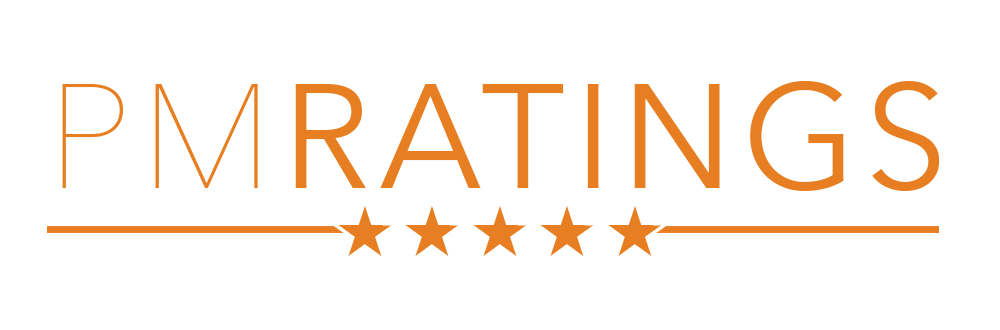
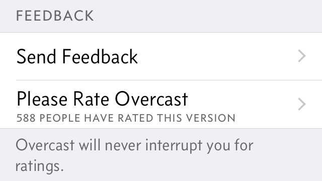

	

	<a href="#overview">Overview</a> &#9733;
	<a href="#example-app">Example App</a> &#9733;
	<a href="#installation">Installation</a> &#9733;
	<a href="#at-a-glance">At a Glance</a> &#9733; 
	<a href="#documentation">Documentation</a> 

A drop-in button or label to _politely_ encourage users to review your app on the App Store. Created by [Pat Murray](https://twitter.com/_patmurray) and inspired by [Marco Arment](http://www.marco.org)'s [Overcast](https://overcast.fm/) app:  

  

The problem with how iOS apps ask [for](https://david-smith.org/blog/2013/12/16/degradation-or-aspiration/) [ratings](http://www.macworld.com/article/1159659/app_developers_behavior.html) [has](http://daringfireball.net/linked/2013/12/05/eff-your-review) [been](http://www.loopinsight.com/2014/02/04/begging-for-app-ratings/) [long](http://dancounsell.com/articles/prompting-for-app-reviews) [discussed](http://www.apptentive.com/blog/ratings-prompts-dont-have-to-suck-inside-mobile-apps/) [online](http://www.marco.org/2011/05/05/apps-prompting-for-reviews). Marco outlines, in his post [_How Overcast asks for reviews_](http://www.marco.org/2014/12/05/how-overcast-asks-for-reviews), a less intrusive way of asking for ratings. I implemented this is my app [NCIS: Gibbs' Rules](http://rules.patmurray.co) to much success.  

 

## Overview
#### Briefly
PMRatings can be used in two main ways:  
- As a `UITableViewCell` subclass for adding an Overcast style button to your settings screen
- To return a `NSString` to be used in your own controls.

PMRatings can be used in both locale independent or locale focused mode. Locale independent gets ratings from the US store, locale focused gets ratings from the user's local store. PMRatings caches the most up to date ratings count in `NSUserDefaults`.

#### Current State
Current version is pre-0.1. Much work is still to happen. I would not reccomend using this in any app (shipping or not)

## Example App

  

## Installation
TBC

## At a Glance
TBC

## Documentation
TBC

# License
The MIT License (MIT)

Copyright © 2015 Patrick Murray 

Permission is hereby granted, free of charge, to any person obtaining a copy
of this software and associated documentation files (the "Software"), to deal
in the Software without restriction, including without limitation the rights
to use, copy, modify, merge, publish, distribute, sublicense, and/or sell
copies of the Software, and to permit persons to whom the Software is
furnished to do so, subject to the following conditions:

The above copyright notice and this permission notice shall be included in
all copies or substantial portions of the Software.

THE SOFTWARE IS PROVIDED "AS IS", WITHOUT WARRANTY OF ANY KIND, EXPRESS OR
IMPLIED, INCLUDING BUT NOT LIMITED TO THE WARRANTIES OF MERCHANTABILITY,
FITNESS FOR A PARTICULAR PURPOSE AND NONINFRINGEMENT. IN NO EVENT SHALL THE
AUTHORS OR COPYRIGHT HOLDERS BE LIABLE FOR ANY CLAIM, DAMAGES OR OTHER
LIABILITY, WHETHER IN AN ACTION OF CONTRACT, TORT OR OTHERWISE, ARISING FROM,
OUT OF OR IN CONNECTION WITH THE SOFTWARE OR THE USE OR OTHER DEALINGS IN
THE SOFTWARE.
